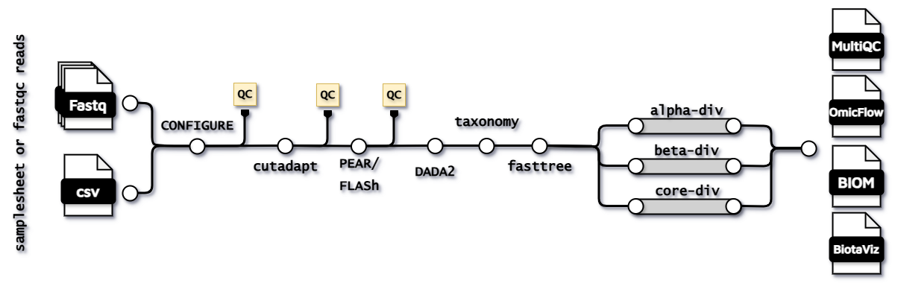

[](https://gitlab.cmbi.umcn.nl/rtc-bioinformatics/metatonx/-/commits/main)
[](https://gitlab.cmbi.umcn.nl/rtc-bioinformatics/metatonx/-/releases)
[](https://www.nextflow.io/)
[](https://www.docker.com/)
[](https://sylabs.io/docs/)
[](https://code.askimed.com/nf-test)

# ATTENTION!
### This repository is not being updated anymore, please refer to [**new repo**](https://github.com/CMG-GUTS/metataxonx) !!

## Introduction **metaTAXONx**

The 16S pipeline is a best-practice suite for the preprocessing, denoising and annotation of sequencing data obtained via 16S rRNA marker-gene sequencing. The pipeline contains [NF-core modules](https://github.com/nf-core/modules) and other local modules that are in the similar format. It can be runned via both docker and singularity containers.

{width=90%}

## Pipeline summary

The pipeline is able to perform different taxonomic annotation on either (single/paired) reads. The different subworkflows can be defined via `--bypass_<method>` flags, a full overview is shown by running `--help`.

The pipeline performs preprocessing of the reads via the removal of primers or adapters via [cutadapt](https://cutadapt.readthedocs.io/en/stable/) and paired-end read merging via either [FLASH](https://www.psc.edu/resources/software/flash/) or [PEAR](https://cme.h-its.org/exelixis/web/software/pear/doc.html). Before and after each step the quality control will be assessed via [fastqc](https://www.bioinformatics.babraham.ac.uk/projects/fastqc/) and a [multiqc](https://github.com/MultiQC/MultiQC) report is created as output. The denoising of single-end reads is performed via [DADA2](https://benjjneb.github.io/dada2/) in batches or in paralell with the module [run-dada2-batch](https://github.com/agusinac/run-dada2-batch).

### Taxonomy assignment

The ASV (generated by DADA2 after denoising) are by default being classified with [VSEARCH](https://github.com/torognes/vsearch) alignment against the [SILVA-138 SSU database](https://www.arb-silva.de/documentation/release-138/) (Ref NR 99; i.e. non-redundant 99% identity), which is a 16S rRNA gene sequences reference database for taxonomic classification. This is part of the _"classify-consensus-vsearch”_ [QIIME2 feature classifier module](https://amplicon-docs.qiime2.org/en/stable/references/plugins/feature-classifier.html). The data can be visualised as a comprehensive report via [OmicFlow](https://github.com/agusinac/OmicFlow) or as a human-readable format via [BiotaViz](https://github.com/ederveen/BiotaViz). 

> [!NOTE]
> Classifiers need to be built with a sklearn version: 1.4.0

Specific pre-built classifiers can be assigned via `--classifier_name`, which are obtained from [QIIME2 pre-built classifiers](https://library.qiime2.org/data-resources#naive-bayes-classifiers). A custom classifier can be supplied via the `--classifier_custom` flag, a thorough guide on how to create your own classifier can be found on this [QIIME2 forum](https://forum.qiime2.org/t/processing-filtering-and-evaluating-the-silva-database-and-other-reference-sequence-data-with-rescript/15494).

### Diversity analysis

The pipeline uses [QIIME2](https://amplicon-docs.qiime2.org/en/stable/) for the construction of a phylogentic tree via [fasttree](https://amplicon-docs.qiime2.org/en/stable/references/plugins/phylogeny.html#q2-action-phylogeny-fasttree) and for diversity analysis, such as [alpha diversity](https://amplicon-docs.qiime2.org/en/stable/references/plugins/diversity.html#q2-action-diversity-alpha-rarefaction) and [beta diversity](https://amplicon-docs.qiime2.org/en/stable/references/plugins/diversity.html#q2-action-diversity-beta-rarefaction). Moreover, the pipeline uses rarefied data to ensure consistent sampling depth.

## Installation
> [!NOTE]
> Make sure you have installed the latest [nextflow](https://www.nextflow.io/docs/latest/install.html#install-nextflow) version! 

Clone the repository in a directory of your choice:
```bash
git clone https://gitlab.cmbi.umcn.nl/rtc-bioinformatics/metataxonomics-DSL2.git
```

The pipeline is containerised, meaning it can be runned via docker or singularity images. No further actions need to be performed when using the docker profile, except a docker registery needs to be set on your local system, see [docker](https://docs.docker.com/engine/install/). In case singularity is used, images are automatically cached within the project directory.

## Usage
Since the latest version, metaBIOMx works with both a samplesheet (CSV) format or a path to the input files. Preferably, samplesheets should be provided.
```bash
nextflow run main.nf --input <samplesheet.csv> -work-dir work -profile singularity
nextflow run main.nf --input <'*_{1,R1,2,R2}.{fq,fq.gz,fastq,fastq.gz}'> -work-dir work -profile singularity
```

### 📋 Sample Metadata File Specification

metaTAXONx expects your sample input data to follow a **simple, but strict** structure to ensure compatibility and allow upfront validation. The input should be provided as a **CSV** file where **each entry = one sample** with specified sequencing file paths. Additional properties not mentioned here will be ignored by the validation step.

---

### **Minimum requirement**
- **`sample_id`** ➡ every entry **must** have a unique, non-empty sample identifier.
- No spaces are allowed in sample IDs — use underscores `_` or dashes `-` instead.
- **`forward_read`** ➡ every entry **must** provide a path to an existing forward read FASTQ file (gzipped).
- If `reverse_read` is provided, `forward_read` must also be present.
Example:

| sample_id | forward_read | reverse_read |
|-----------|---------------|--------------------|
| sample1   | sample1_R1.fastq.gz | sample1_R2.fastq.gz |
| sample_2  | D029327_1.fastq.gz | D029327_2.fastq.gz |
| S3        | L9283_R1.fastq.gz | L9283_R1.fastq.gz |

---

### **Properties and Validation Rules**

#### 🔹 Required properties

| Property     | Type   | Rules / Description                                                                                   |
|--------------|--------|----------------------------------------------------------------------------------------------------|
| `sample_id`     | string | Unique sample ID with no spaces (`^\S+$`). Serves as an identifier.                                  |
| `forward_read` | string | File path to forward sequencing read. Must be non-empty string matching FASTQ gzipped pattern. File must exist. |

#### 🔹 Optional property

| Property       | Type   | Rules / Description                                                                                   |
|----------------|--------|----------------------------------------------------------------------------------------------------|
| `reverse_read` | string | File path to reverse sequencing read. Same constraints as `forward_read`. Required if specified.   |

#### 🔹 Pattern‑based columns 
You can define extra variables using special prefixes:
- **`CONTRAST_...`** → grouping/category labels used in differential comparisons  
  Example: `CONTRAST_Treatment` with values `Drug` / `Placebo`
These prefixes are used to generate an automated `OmicFlow` report with alpha, beta diversity and compositional plots. For more information see [OmicFlow](https://github.com/agusinac/OmicFlow).

## Support

If you are having issues, please [create an issue](https://gitlab.cmbi.umcn.nl/rtc-bioinformatics/metataxonomics-DSL2/-/issues)

## Citations

You can cite the `metataxonx` using the following DOI: 

An extensive list of references for the tools used by the pipeline can be found in the [`CITATIONS.md`](CITATIONS.md)
file.