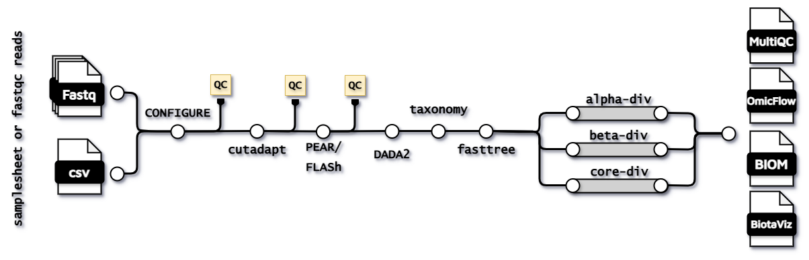

[](https://github.com/CMG-GUTS/metataxonx/actions/workflows/nf-build-stub.yaml)
[](https://www.nextflow.io/)
[](https://www.docker.com/)
[](https://sylabs.io/docs/)
[](https://code.askimed.com/nf-test)

## Introduction **metaTAXONx**

This pipeline is a best-practice suite for the pre-processing, denoising, classification and annotation of Illumina short-read sequencing data obtained by 16S rRNA marker-gene sequencing. The pipeline contains [NF-core modules](https://github.com/nf-core/modules) and other local modules that are in the similar format. It can be runned via both docker and singularity containers.

<p align="center">
    
</p>

## Pipeline summary

The pipeline is able to perform different taxonomic annotation on either (single/paired) reads. The different subworkflows can be defined via `--bypass_<method>` flags, a full overview is shown by running `--help`.

The pipeline performs preprocessing of the reads via the removal of primers or adapters via [cutadapt](https://cutadapt.readthedocs.io/en/stable/) and paired-end read merging via either [FLASH](https://www.psc.edu/resources/software/flash/) or [PEAR](https://cme.h-its.org/exelixis/web/software/pear/doc.html). Before and after each step the quality control will be assessed via [fastqc](https://www.bioinformatics.babraham.ac.uk/projects/fastqc/) and a [multiqc](https://github.com/MultiQC/MultiQC) report is created as output. The denoising of single-end reads is performed via [DADA2](https://benjjneb.github.io/dada2/) in batches or in paralell with the module [run-dada2-batch](https://github.com/agusinac/run-dada2-batch).

### Taxonomy assignment

The ASV (generated by DADA2 after denoising) are by default being classified with [VSEARCH](https://github.com/torognes/vsearch) alignment against the [SILVA-138 SSU database](https://www.arb-silva.de/documentation/release-138/) (Ref NR 99; i.e. non-redundant 99% identity), which is a 16S rRNA gene sequences reference database for taxonomic classification. This is part of the _"classify-consensus-vsearch”_ [QIIME2 feature classifier module](https://amplicon-docs.qiime2.org/en/stable/references/plugins/feature-classifier.html). The data can be visualised as a comprehensive report via [OmicFlow](https://github.com/agusinac/OmicFlow) or as a human-readable format via [BiotaViz](https://github.com/ederveen/BiotaViz). 

> [!NOTE]
> Classifiers need to be built with a sklearn version: 1.4.0

Specific pre-built classifiers can be assigned via `--classifier_name`, which are obtained from [QIIME2 pre-built classifiers](https://library.qiime2.org/data-resources#naive-bayes-classifiers). A custom classifier can be supplied via the `--classifier_custom` flag, a thorough guide on how to create your own classifier can be found on this [QIIME2 forum](https://forum.qiime2.org/t/processing-filtering-and-evaluating-the-silva-database-and-other-reference-sequence-data-with-rescript/15494).

### Diversity analysis

The pipeline uses [QIIME2](https://amplicon-docs.qiime2.org/en/stable/) for the construction of a phylogentic tree via [fasttree](https://amplicon-docs.qiime2.org/en/stable/references/plugins/phylogeny.html#q2-action-phylogeny-fasttree) and for diversity analysis, such as [alpha diversity](https://amplicon-docs.qiime2.org/en/stable/references/plugins/diversity.html#q2-action-diversity-alpha-rarefaction) and [beta diversity](https://amplicon-docs.qiime2.org/en/stable/references/plugins/diversity.html#q2-action-diversity-beta-rarefaction). Moreover, the pipeline uses rarefied data to ensure consistent sampling depth.

## Running on the Surf Research Cloud
Create your VM with the `metataxonx-nf` catalog item and choose the size. Once the VM is created you can access it via the `ssh username@ip-address` as long as you have an `rsa` ssh key set-up on your profile. 

A list of available arguments can be viewed with `metataxonx --help`, getting only nextflow options can be done with `metataxonx -h`.

### Usage & test run
You can start a simple test-run as follows:
```bash
metataxonx -profile test,docker -work-dir work --output test_result
```

When running it on real data the user can either give a samplesheet (via `--input`) or pass the reads (via `--reads`). During each run the `-profile docker` needs to be supplied, other profiles besides `test` and `docker` are not supported in this catalog. 

Example run:
```bash
metataxonx -profile docker -work-dir work --reads "*{R1,R2}.fastq.gz" --output test_result # adding reads
metataxonx -profile docker -work-dir work --input samplesheet.csv --output test_result # adding samplesheet
```

> [!NOTE]
> The memory requirements are restricted to a 1 core 8GB RAM machine

To change the cpus/memory usage for different processes one can increase the cpu with `--process_low_cpu`, `--process_med_cpu`, `--process_high_cpu` and restrict the overall maximum cpus with `--cpus`. To increase the memory, one should supply an extra config file called for example `memory.config` with the following content. Increasing memory should never be a single number but as `10.GB` where the number `10` is the value and `.GB` the unit.
```
process {

    cpus   = {  1    * task.attempt     }
    memory = {  1.GB * task.attempt     }
    time   = {  1.h  * task.attempt     }

    errorStrategy = { task.exitStatus in ((130..145) + 104) ? 'retry' : 'finish' }
    maxRetries    = 1
    maxErrors     = '-1'

    // Process-specific resource requirements
    // NOTE - Please try and re-use the labels below as much as possible.
    //        These labels are used and recognised by default in DSL2 files hosted on nf-core/modules.
    //        If possible, it would be nice to keep the same label naming convention when
    //        adding in your local modules too.
    // See https://www.nextflow.io/docs/latest/config.html#config-process-selectors
    withLabel:process_single {
        cpus   = {  1                       }
        memory = {  1.GB * task.attempt     }
        time   = {  1.h  * task.attempt     }
    }
    withLabel:process_low {
        // Adjust memory with e.g. 10.GB
        cpus   = {  params.process_low_cpu  * task.attempt  }
        memory = {  2.GB * task.attempt    } 
        time   = {  1.h   * task.attempt    }
        maxForks = params.cpus.intdiv(params.process_low_cpu)
    }
    withLabel:process_medium {
        cpus   = {  params.process_med_cpu   * task.attempt  }
        memory = {  4.GB * task.attempt    }
        time   = {  1.h   * task.attempt    }
        maxForks = params.cpus.intdiv(params.process_med_cpu)
    }
    withLabel:process_high {
        cpus   = {  params.process_high_cpu   * task.attempt  }
        memory = {  6.GB * task.attempt    }
        time   = {  1.h  * task.attempt    }
        maxForks = params.cpus.intdiv(params.process_high_cpu)
    }
    withLabel:error_ignore {
        errorStrategy = 'ignore'
    }
    withLabel:error_retry {
        errorStrategy = 'retry'
        maxRetries    = 2
    }
}
```

### 📋 Sample Metadata File Specification

metaTAXONx expects your sample input data to follow a **simple, but strict** structure to ensure compatibility and allow upfront validation. The input should be provided as a **CSV** file where **each entry = one sample** with specified sequencing file paths. Additional properties not mentioned here will be ignored by the validation step.

---

### **Minimum requirement**
- **`sample_id`** ➡ every entry **must** have a unique, non-empty sample identifier.
- No spaces are allowed in sample IDs — use underscores `_` or dashes `-` instead.
- **`forward_read`** ➡ every entry **must** provide a path to an existing forward read FASTQ file (gzipped).
- If `reverse_read` is provided, `forward_read` must also be present.
Example:

| sample_id | forward_read | reverse_read |
|-----------|---------------|--------------------|
| sample1   | sample1_R1.fastq.gz | sample1_R2.fastq.gz |
| sample_2  | D029327_1.fastq.gz | D029327_2.fastq.gz |
| S3        | L9283_R1.fastq.gz | L9283_R1.fastq.gz |

---

### **Properties and Validation Rules**

#### 🔹 Required properties

| Property     | Type   | Rules / Description                                                                                   |
|--------------|--------|----------------------------------------------------------------------------------------------------|
| `sample_id`     | string | Unique sample ID with no spaces (`^\S+$`). Serves as an identifier.                                  |
| `forward_read` | string | File path to forward sequencing read. Must be non-empty string matching FASTQ gzipped pattern. File must exist. |

#### 🔹 Optional property

| Property       | Type   | Rules / Description                                                                                   |
|----------------|--------|----------------------------------------------------------------------------------------------------|
| `reverse_read` | string | File path to reverse sequencing read. Same constraints as `forward_read`. Required if specified.   |

#### 🔹 Pattern‑based columns 
You can define extra variables using special prefixes:
- **`CONTRAST_...`** → grouping/category labels used in differential comparisons  
  Example: `CONTRAST_Treatment` with values `Drug` / `Placebo`
These prefixes are used to generate an automated `OmicFlow` report with alpha, beta diversity and compositional plots. For more information see [OmicFlow](https://github.com/agusinac/OmicFlow).

## Support

If you are having issues, please [create an issue](https://github.com/CMG-GUTS/metataxonx/issues)

## Citations

You can cite the `metataxonx` using the [DOI link](https://doi.org/10.48546/WORKFLOWHUB.WORKFLOW.2054.1) 

An extensive list of references for the tools used by the pipeline can be found in the [`CITATIONS.md`](CITATIONS.md)
file.